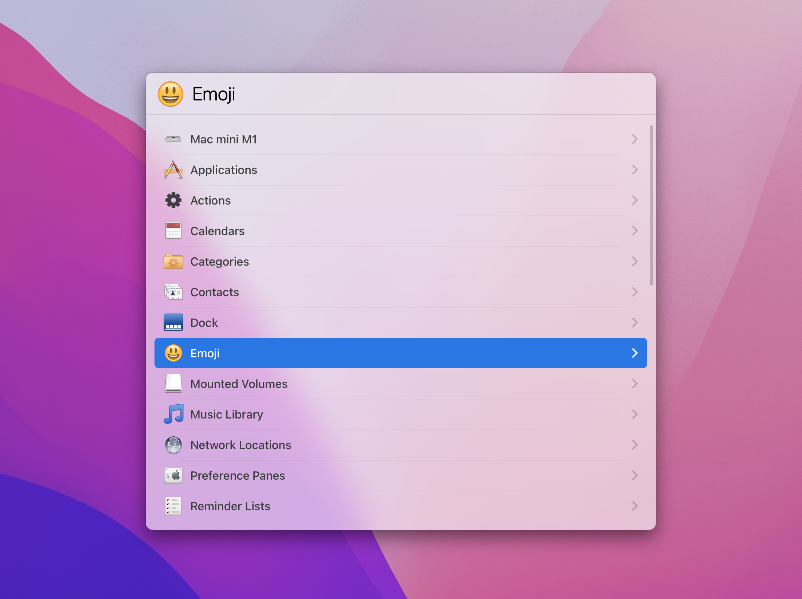

# LaunchBar Themes & Actions

**Dark and Light themes for LaunchBar.**

There are 2 slight variations for each theme. Default size icons, and larger icons.
 
 
Dark theme with larger icons
 

 

Light theme with larger icons
 

 
I've also included [launchbar-theme-values.pdf](https://github.com/jonohunt/LaunchBar-Themes-Actions/blob/main/README.md) listing names, colours, etc. of the different parts of the UI to help others theming LaunchBar. 
 
I can't remember exactly who shared this (Manfred?). It was just after the release of LaunchBar 6, and was meant as a temporary guide until Objective Development released an 'official guide' (which never happened).
