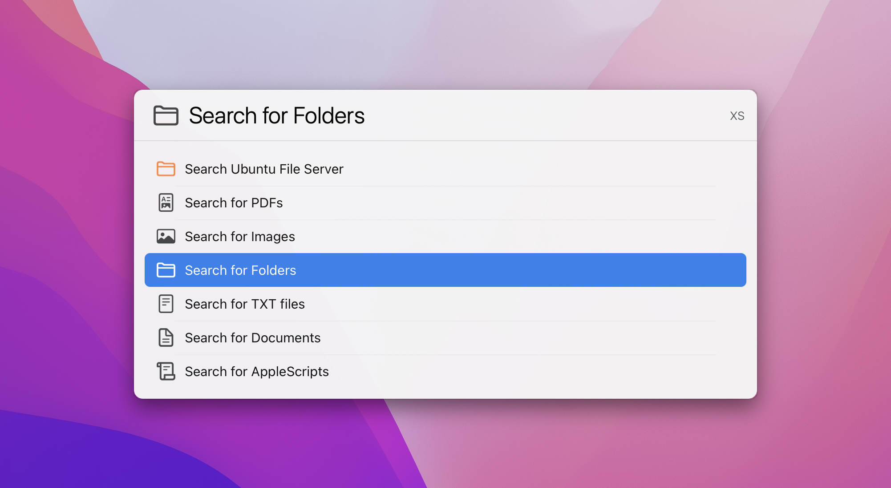
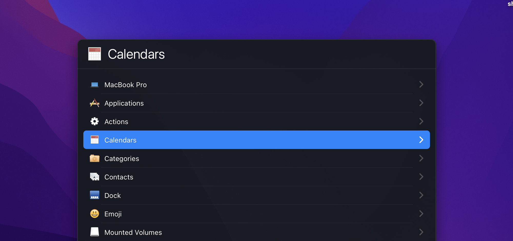
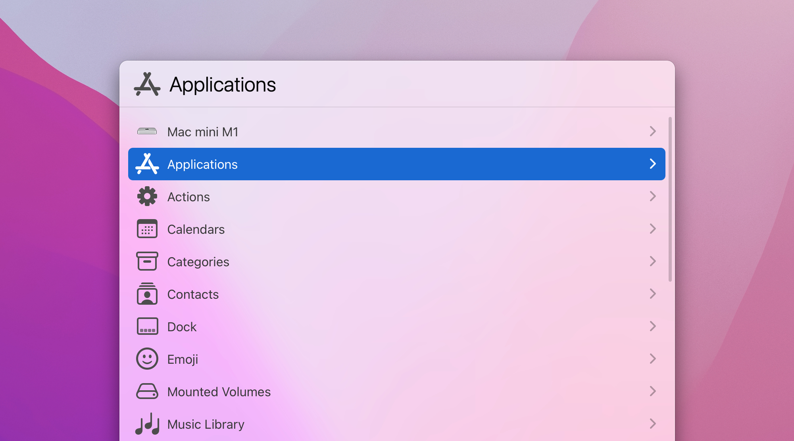

# LaunchBar Themes & Actions

## Dark and Light themes for LaunchBar

 
 

There's a few different sizes for each theme, S, M, L, and XL. 
 
Dark theme, XL and Small sizes shown.
 

 

Light theme, XL and Small sizes shown.
 

 
I've also included [launchbar-theme-values.pdf](https://github.com/jonohunt/LaunchBar-Themes-Actions/blob/main/README.md) listing names, colours, etc. of the different parts of the UI to help others theming LaunchBar. 
 
I can't remember exactly who shared this (Manfred?). It was just after the release of LaunchBar 6, and was meant as a temporary guide until Objective Development released an 'official guide' (which never happened).